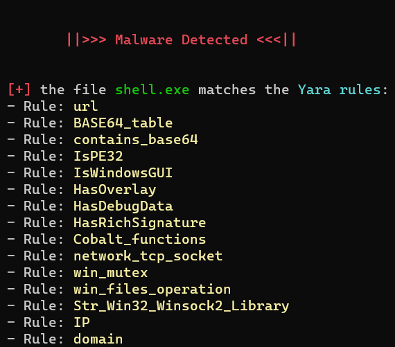

> [!CAUTION]
> The Scan is not working properly hence BROKEN, we are working on it  

# YaraGuard - Unleashing the Power of YARA Rules in Malicious File Scanning

YaraGuard is an advanced malware analysis tool designed to empower users in the relentless pursuit of securing digital environments. At its core, YaraGuard utilizes YARA rules, providing a sophisticated and effective means of scanning files for potential threats.

## Key Features

- **Custom YARA Rules:** YaraGuard incorporates a diverse set of YARA rules, including custom-crafted ones meticulously designed for precision. Special thanks to the countless individuals and organizations whose publicly available YARA rules have been incorporated into this tool, contributing to its comprehensive malware detection capabilities.
    
- **Precision Scanning:** By leveraging the power of YARA rules, YaraGuard achieves precision scanning, accurately pinpointing potential threats within files. The tool's enhanced detection capabilities make it a valuable asset for security professionals and enthusiasts alike.

- **YaraGuard** supports analysis for a wide range of file formats
    
- **Threat Intelligence:** YaraGuard goes beyond mere identification of threats; it furnishes valuable insights into the intricate nature of potential malicious content. The generated reports, exemplified below, shedding light on the characteristics and behaviors of identified threats:




## How It Works

YaraGuard's operation is centered around the execution of custom YARA rules during the scanning process. When invoked with the command `python3 scan.py {file_to_scan}`, the tool dynamically applies these rules to scrutinize the specified file for patterns associated with malware. The result is a comprehensive analysis report, detailing any identified threats.


## Requirements

To use YaraGuard, ensure that you have the following dependencies installed:

- [yara-python](https://github.com/VirusTotal/yara-python): YARA is a pattern matching tool used for malware identification.
    
- [rich](https://github.com/willmcgugan/rich): Rich is a Python library for rich text and beautiful formatting in the terminal.
    
```
git clone https://github.com/MY7H404/YaraGuard.git
cd YaraGuard
pip3 install yara-python / or ( pip install -U git+https://github.com/VirusTotal/yara-python )
pip3 install rich
python3 scan.py {file_to_scan}
```
## Example

```
python3 scan.py file_to_scan
```

This command initiates a scan on the specified file, providing real-time feedback on potential malicious content detected by YARA rules.

## Run Using Docker

Hoping that docker is already installed and ready to use, run the following commands

```
docker build --no-cache -t yaraguard .
docker run --rm -p 5000:5000 yaraguard
```

*You can also pull the image directly from the docker hub*

```
docker pull docker pull japurando07/yaraguard:v1.0
docker run -d --rm -p 5000:5000 japurando07/yaraguard:v1.0
```

Now we can access the site from host by visiting `http://localhost:5000`

## Contribution

Contributions to YaraGuard are welcome. If you encounter issues or have suggestions for improvements, feel free to open an issue or submit a pull request.

## Contributors

A big thank you to the contributors who have helped make YaraGuard even better!

<a href="https://github.com/MY7H404/YaraGuard/graphs/contributors">
  
</a>

## License

This project is licensed under the [GNU General Public License v3.0](https://github.com/MY7H404/YaraGuard/blob/main/LICENSE).
